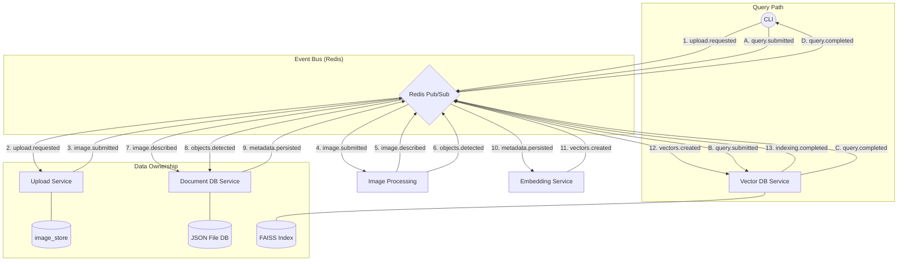

# Image Annotation & Retrieval System

A modular, event-driven system for processing images, detecting objects, and enabling semantic search using vector embeddings and document metadata.

## 🏗 Architecture & Technology Stack

The system is built on a **Pub-Sub** architecture using **Redis** as the central nervous system. Services are strictly decoupled and communicate exclusively through the event bus.

### System Diagram



### Technology Breakdown

| Service | Technology | Role |
| :--- | :--- | :--- |
| **CLI** | **Python Typer** | Entry point for requesting uploads and searching. |
| **Upload** | **Python** | Listens for requests, saves images to `image_store`. |
| **Image Processing**| **Gemini 1.5 Flash** | Generates image descriptions and detects objects. |
| **Document DB** | **JSON/File** | Stores metadata, detections, and AI descriptions. |
| **Embedding** | **Deterministic Hashing**| Generates vectors for detected labels. |
| **Vector DB** | **FAISS** | Maintains similarity index and handles lookups. |
| **Event Bus** | **Redis** | Orchestrates asynchronous communication. |

## 🚀 Getting Started

### 1. Prerequisites
- **Python 3.10+**
- **Redis Server**
- **Google API Key** (Optional, for Gemini features)

### 2. Setup Environment
```bash
pip install -r requirements.txt
export GOOGLE_API_KEY="your_key_here"
```

### 3. Running the System
Start the services in separate terminal windows:
```bash
# Terminal 1
python services/upload/service.py

# Terminal 2
python services/image_processing/service.py

# Terminal 3
python services/document_db/service.py

# Terminal 4
python services/embedding/service.py

# Terminal 5
python services/vector_db/service.py
```

Then use the CLI:
```bash
python services/cli/main.py upload sample_data/dog.jpg
python services/cli/main.py search "dog"
```

## 📡 Event Lifecycle

1.  **`upload.requested`**: CLI requests an image to be ingested.
2.  **`image.submitted`**: Ingestion complete; raw image is saved to `image_store`.
3.  **`image.described`**: Gemini has generated a text description of the image.
4.  **`objects.detected`**: Image Processing complete; labels and coordinates found.
5.  **`metadata.persisted`**: Document DB has updated the record with detections and description.
6.  **`vectors.created`**: Embedding Service has generated numerical representations.
7.  **`indexing.completed`**: Vector DB has updated its index; system is now searchable.
8.  **`query.submitted`**: User has initiated a search.
9.  **`query.completed`**: Search results are ready for the CLI.

## 🛠 Directory Structure

```text
.
├── services/
│   ├── cli/               # Typer-based CLI
│   ├── upload/            # Image ingestion (Async)
│   ├── image_processing/  # Gemini & AI Inference
│   ├── document_db/       # Metadata Persistence
│   ├── embedding/         # Vector Generation
│   └── vector_db/         # Indexing (FAISS)
├── common/                # Shared Redis & Pydantic logic
├── image_store/           # Persistent storage for raw images
└── tests/                 # Integration & Unit tests
```
