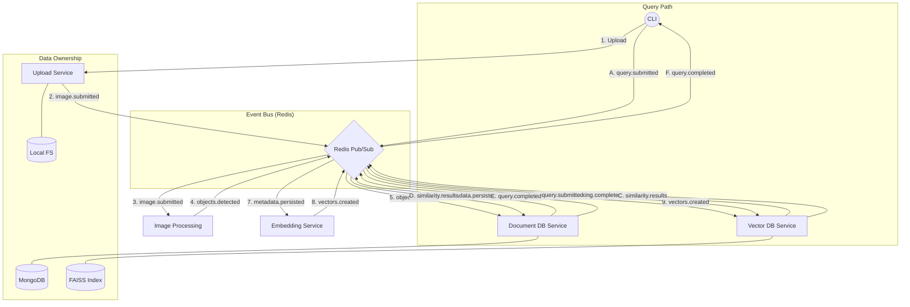

# Image Annotation & Retrieval System

A modular, event-driven system for processing images, detecting objects, and enabling semantic search using vector embeddings and document metadata.

## 🏗 Architecture & Technology Stack

The system is built on a **Pub-Sub** architecture using **Redis** as the central nervous system. Services are strictly decoupled, ensuring that no service bypasses the event bus to talk to another's data store.

### System Diagram



### Technology Breakdown

| Service | Technology | Role |
| :--- | :--- | :--- |
| **CLI** | **Python Typer** | Entry point for triggering uploads and searching objects. |
| **Upload** | **FastAPI** | Validates image files and persists them to the storage layer. |
| **Image Processing**| **PyTorch (YOLO)** | Detects objects, bounding boxes, and initial labels. |
| **Document DB** | **MongoDB** | Stores rich, nested JSON metadata for images and detections. |
| **Embedding** | **CLIP / Transformers** | Generates high-dimensional vectors for detected objects. |
| **Vector DB** | **FAISS** | Maintains the similarity index and handles vector lookups. |
| **Event Bus** | **Redis** | Orchestrates asynchronous communication between all services. |

## 🚀 Getting Started

### 1. Prerequisites
- **Python 3.10+**
- **Redis Server** (See below for installation)

### 2. Install Redis
On macOS:
```bash
brew install redis
brew services start redis
```

### 3. Setup Environment
```bash
pip install -r requirements.txt
```

### 4. Running the System
Start the services in separate terminal windows:
```bash
# Terminal 1
python services/image_processing/service.py

# Terminal 2
python services/document_db/service.py

# Terminal 3
python services/embedding/service.py

# Terminal 4
python services/vector_db/service.py
```

Then use the CLI:
```bash
python services/cli/main.py upload sample_data/test_image.jpg
python services/cli/main.py search "dog"
```

## 🧪 Testing

### Unit & Mock Tests
Run standard tests using `fakeredis`:
```bash
pytest
```

### Real Redis Integration Test
To run the full end-to-end pipeline test against your local Redis instance:
```bash
RUN_REAL_REDIS=true PYTHONPATH=. pytest tests/test_real_redis_pipeline.py
```
*Note: This test is skipped by default to avoid failures in CI environments like GitHub Actions.*

## 📡 Event Lifecycle

1.  **`image.submitted`**: Ingestion complete; raw image is ready for analysis.
2.  **`objects.detected`**: Image Processing complete; labels and coordinates found.
3.  **`metadata.persisted`**: Document DB has stored the detections; ready for vectorization.
4.  **`vectors.created`**: Embedding Service has generated numerical representations.
5.  **`indexing.completed`**: Vector DB has updated its index; system is now searchable.
6.  **`query.submitted`**: User has initiated a search (text or image similarity).

## 🛡 System Guarantees

*   **Idempotency**: Services track `event_id` to prevent duplicate processing of the same image/query.
*   **Robustness**: Defensive validation ensures that malformed payloads do not crash subscribers.
*   **Eventual Consistency**: The query path reflects the latest state once the indexing cycle completes.
*   **Auditability**: The event bus allows for deterministic replay and fault injection testing.

## 🛠 Directory Structure

```text
.
├── services/
│   ├── cli/               # Typer-based CLI
│   ├── upload/            # Image ingestion (FastAPI)
│   ├── image-processing/  # AI Inference (YOLO)
│   ├── document-db/       # MongoDB Persistence
│   ├── embedding/         # Vector Generation (CLIP)
│   └── vector-db/         # Indexing (FAISS)
├── common/                # Shared Redis & Pydantic logic
├── generator/             # Testing & Event replay utility
└── tests/                 # Integration & Fault-injection tests
```
