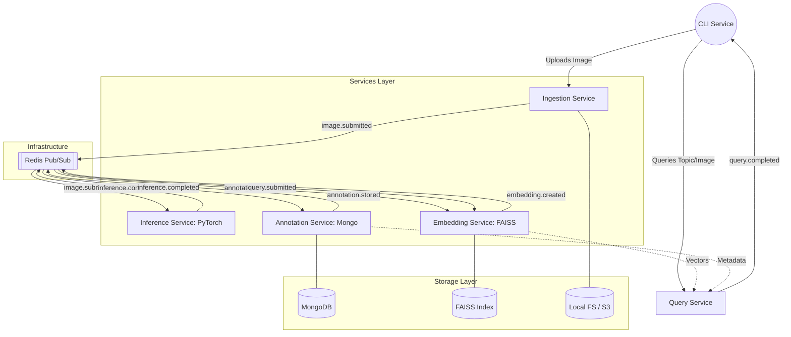

# Image Annotation & Retrieval System

A modular, event-driven system for processing images, detecting objects, and enabling semantic search using vector embeddings and document metadata.

## 🏗 Architecture & Technology Stack

The system is built on a **Pub-Sub** architecture using **Redis** as the central nervous system. Services are decoupled, ensuring asynchronicity and resilience.

### System Diagram



### Technology Breakdown

| Service | Technology | Role |
| :--- | :--- | :--- |
| **Event Bus** | **Redis** | Handles asynchronous messaging and topic distribution. |
| **Ingestion** | **Python/FastAPI** | Validates uploads and persists raw images to local storage. |
| **Inference** | **PyTorch (YOLO)** | Performs object detection and produces classification metadata. |
| **Annotation**| **MongoDB** | A document-oriented store for flexible, nested object metadata. |
| **Embedding** | **FAISS** | Manages vector indices for high-dimensional object similarity search. |
| **Query** | **Python Typer** | Orchestrates metadata lookups and vector similarity results. |
| **Testing** | **Pytest** | Validates idempotency, robustness, and eventual consistency. |

## 📡 Event Lifecycle

1.  **`image.submitted`**: Triggered by Ingestion. Contains image path and ID.
2.  **`inference.completed`**: Triggered by Inference. Contains detected objects and bounding boxes.
3.  **`annotation.stored`**: Triggered by Annotation. Confirms metadata is persisted in MongoDB.
4.  **`embedding.created`**: Triggered by Embedding. Confirms vectors are indexed in FAISS.
5.  **`query.submitted`**: Triggered by CLI. Initiates a search across the index and metadata.

## 🛡 System Guarantees

*   **Idempotency**: Services check `event_id` against a local cache before processing to prevent duplicate state changes.
*   **Robustness**: All services utilize defensive validation (Pydantic) to handle malformed events gracefully.
*   **Eventual Consistency**: The system prioritizes availability; search results reflect the latest processed state as events propagate.
*   **Deterministic Replay**: The Event Generator can use a fixed seed to replay specific traffic patterns for debugging.

## 🛠 Directory Structure

```text
.
├── services/
│   ├── ingestion/     # Image handling (FastAPI/Local FS)
│   ├── inference/     # Object Detection (PyTorch/Mock)
│   ├── annotation/    # Metadata Store (MongoDB)
│   ├── embedding/     # Vector Search (FAISS)
│   └── query/         # Orchestrator
├── common/            # Redis logic, Event schemas (Pydantic)
├── generator/         # Chaos testing & Event replay
├── cli/               # CLI Interface (Typer)
└── tests/             # Idempotency & Consistency tests
```
